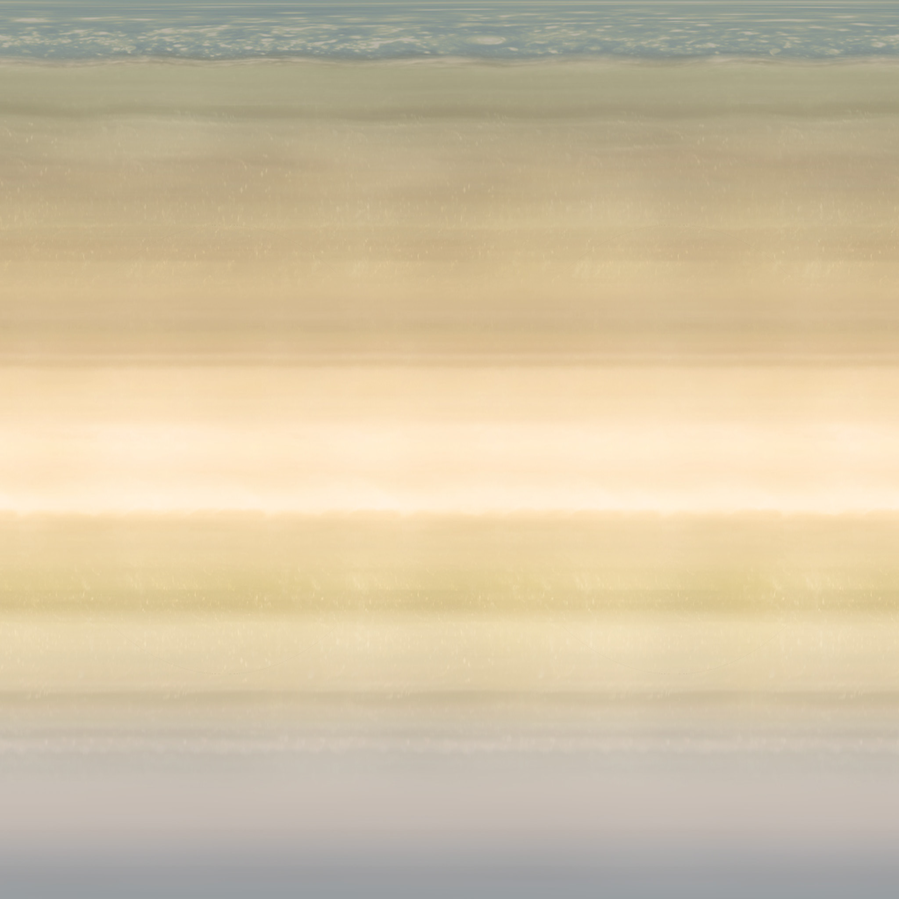

# CST 325 Final - WebGL Solar System Model

 
This model depicts our solar system in adjusted astronomical units. The following planetary bodies are depicted:
  
 1. Sun
 2. Mercury
 3. Venus
 4. Earth
 5. Earth's Moon
 6. Mars
 7. Jupiter
 8. Saturn
 9. Uranus
 10. Neptune

## Textures
### Planetary Textures
Textures for the planetary bodies were obtained for free from [Solar System Scope](https://www.solarsystemscope.com/textures/).
| **Planetary Body** |                           **Texture**                            |
|--------------------|------------------------------------------------------------------|
| __Sun__            |                 |
| __Mercury__        |             |
| __Venus__          |               |
| __Earth__          |           |
| __Earth's Moon__   |                |
| __Mars__           |                |
| __Jupiter__        |             |
| __Saturn__         |              |
| __Uranus__         |              |
| __Neptune__        |             |

### Starfield Skybox
The skybox used for this model was generated using the Open Source Application, [Spacescape](https://github.com/petrocket/spacescape).
| **Planetary Body** | **Texture** |
|--------------------|-------------|
| __Right__          |              |
| __Left__           |               |
| __Top__            |                |
| __Bottom__         |             |
| __Front__          |              |
| __Back__           |               |

## Scale
Adjusted astronomical units were used to approximate a relative scale for planetary bodies (except for the sun, which was downsized by half, even in the 'accurate' scale/default setting).
| **Planetary Body** | **Diameter (km)** | **Diameter (au)** | **Diameter (mod. au)** | **Dist. from Sun (km)** | **Dist. from Sun (au)** | **Dist. from Sun (mod. au)** | **Rotational Velocity (km/h)** | **Rotational Velocity (au/h)** | **Rotational Velocity (mod. au/h)** | **Orbital Velocity (km/h)** | **Orbital Velocity (au/h)** | **Orbital Velocity (mod. au/h)** |
|:------------------:|:-----------------:|:-----------------:|:----------------------:|:-----------------------:|:-----------------------:|:----------------------------:|:------------------------------:|:------------------------------:|:-----------------------------------:|:---------------------------:|:---------------------------:|:--------------------------------:|
| _Sun_              |         1,391,400 |    0.009300802139 |          0.09300802139 |                       0 |                       0 |                            0 |                          7,189 |               0.00004805481283 |                     0.0004805481283 |                           0 |                           0 |                                0 |
| _Mercury_          |             4,879 |  0.00003261363636 |        0.0003261363636 |              57,900,000 |            0.3870320856 |                  3.870320856 |                          10.83 |            0.00000007239304813 |                  0.0000007239304813 |                     170,503 |              0.001139725936 |                    0.01139725936 |
| _Venus_            |            12,104 |  0.00008090909091 |        0.0008090909091 |             108,200,000 |            0.7232620321 |                  7.232620321 |                           6.52 |             0.0000000435828877 |                   0.000000435828877 |                     126,074 |             0.0008427406417 |                   0.008427406417 |
| _Earth_            |            12,756 |  0.00008526737968 |        0.0008526737968 |             149,600,000 |                       1 |                           10 |                           1574 |               0.00001052139037 |                     0.0001052139037 |                     107,218 |              0.000716697861 |                    0.00716697861 |
| _Earth's Moon_     |             3,475 |  0.00002322860963 |        0.0002322860963 |         **N/A**         |         **N/A**         |            **N/A**           |                           16.7 |              0.000000111631016 |                    0.00000111631016 |                       3,683 |            0.00002461898396 |                  0.0002461898396 |
| _Mars_             |             6,792 |  0.00004540106952 |        0.0004540106952 |             227,900,000 |             1.523395722 |                  15.23395722 |                            866 |              0.000005788770053 |                    0.00005788770053 |                      86,677 |             0.0005793917112 |                   0.005793917112 |
| _Jupiter_          |           142,984 |   0.0009557754011 |         0.009557754011 |             778,600,000 |             5.204545455 |                  52.04545455 |                         45,583 |                0.0003046991979 |                      0.003046991979 |                      47,002 |              0.000314184492 |                    0.00314184492 |
| _Saturn_           |           120,536 |   0.0008057219251 |         0.008057219251 |           1,433,500,000 |             9.582219251 |                  95.82219251 |                         36,840 |                0.0002462566845 |                      0.002462566845 |                      34,701 |             0.0002319585561 |                   0.002319585561 |
| _Uranus_           |            51,118 |    0.000341697861 |          0.00341697861 |           2,872,500,000 |             19.20120321 |                  192.0120321 |                         14,794 |               0.00009889037433 |                     0.0009889037433 |                      24,477 |             0.0001636163102 |                   0.001636163102 |
| _Neptune_          |            49,528 |   0.0003310695187 |         0.003310695187 |           4,495,100,000 |             30.04745989 |                  300.4745989 |                          9,719 |               0.00006496657754 |                     0.0006496657754 |                      19,566 |             0.0001307887701 |                   0.001307887701 |

### Scale Toggle <kbd>S</kbd>
There a two modes for the diameter of planets:

#### Accurate Scale
All of the planets (and moon) are programmed to be the accurate relative sizes, using adjusted astronomical units (the distance of the earth from the sun x 10⁵).

#### Adjusted Scale
All of the planets are sized up, proportional to the sun, for better visibility. Inner planets are multiplied by 16 (the moon by 20) and the outer planets by 4.

### Distance Toggle <kbd>D</kbd>
There are also two modes for the distance of the planets from the sun:

#### Accurate Distance
All of the planets (and moon) are programmed to be the accurate relative distances, using adjusted astronomical units (the distance of the earth from the sun x 10⁵).

#### Adjusted Distance
All of the planets' distances are reduced, for better visibility of outer planets, using the log2(n).

**_NOTE: In the Adjusted Distance Mode, it is harder to see the inner planets, with Mercury phasing into the Sun Geometry. It is solely to view the outer geometries._**
